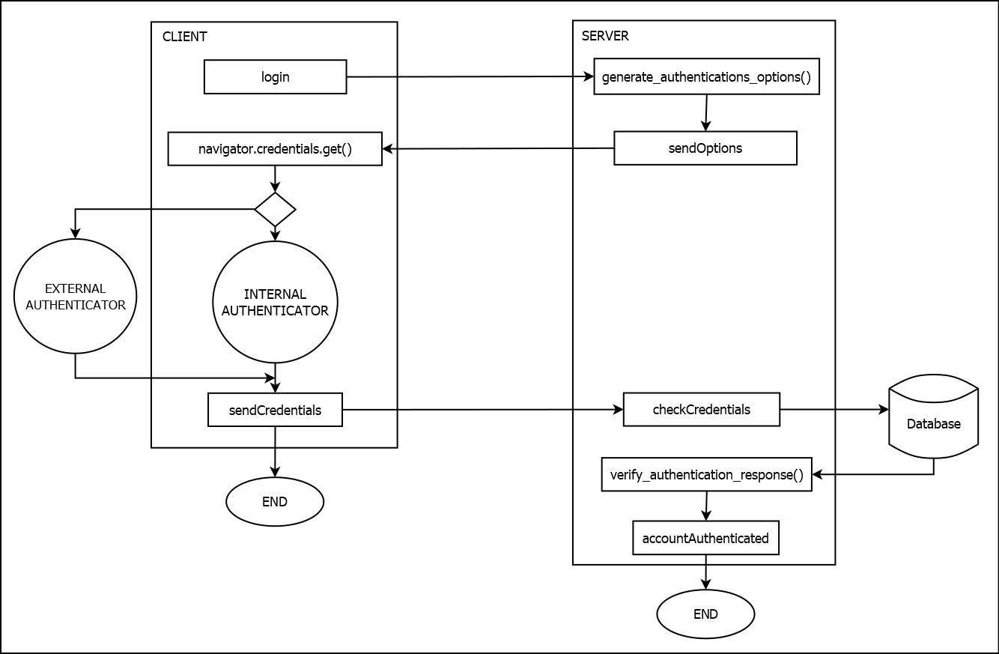

# ICS SIMULATION

## PRECISAZIONI
In un contesto reale si dovrebbe tenere traccia dell'utente durante ogni operazione per verficare se possiede le autorizzazioni necessarie per effettuare determinate azioni. E' da considerare il fatto che registrazione e login sono stati implementati con la libreria webauthn.io inoltre, la libreria è stata implementata in modo da funzionare solo con il protocollo https, quindi è necessario creare un certificato per il server. Per fare ciò, seguire le istruzioni riportate di seguito.

## WEBAUTHN.IO

### REGISTRAZIONE
L'operazione di registrazione può essere fatta soltanto da un nodo specifico (ovvero usersHandler) a cui si può accedere soltanto utilizzando un account con privilegio "admin". Per registrare un nuovo utente si deve specificare l'username e il privilegio cui si vuole associare. Il processo di registrazione segue questo flusso:


### AUTENTICAZIONE
L'operazione di autenticazione può essere fatta da un nodo userHandler o hmi (al primo posso accedere soltanto gli utenti con privilegio "admin"). Il processo di autenticazione segue questo flusso:

## CREAZIONE CERTIFICATO

### REQUISITI
E' obbligato rio aggiungere la CA al trust store del sistema operativo altrimenti il certificato non verrà riconosciuto come attendibile e non sarà possibile utilizzare il protocollo https (obbligatorio per la libreria webauth).
Su Windows, si apre mmc e si aggiunge il certificato alla sezione "Autorità di certificazione radice attendibile"

L'unico modo per poter eseguire il progetto in modo corretto è farlo attraverso la pagina web con dominio localhost, altrimenti il certificato non verrà riconosciuto come attendibile.
### PROCEDURA
https://deliciousbrains.com/ssl-certificate-authority-for-local-https-development/
```bash
openssl req -x509 -new -nodes -sha256 -days 1825 -out myCA.pem # Questo ci crea:
# La chiave privata della CA: privkey.pem
# Il certificato della CA: myCA.pem
```
```bash
# Si genera la chiave privata del server
openssl genrsa -out server.key 2048
```
```bash
# Poi creiamo la Certificate Signing Request (CSR), ovvero la richiesta di firma del certificato del server alla CA
openssl req -new -key server.key -out server.csr
```
```bash
# In server.ext modificare alt_names.DNS.1 col FQDN (Fully Qualified Domain Name)
# Poi firmiamo il certificato del server con la CA
openssl x509 -req -in server.csr -CA myCA.pem -CAkey privkey.pem -CAcreateserial -out server.crt -days 1825 -sha256 -extfile server.ext
```

## DESCRIZIONE ARCHITETTURA
Il progetto è stato realizzato con l'obiettivo di simulare un sistema di controllo di una fabbrica in cui è possibile monitorare e controllare il livello dell'acqua in due tank e controllare un braccio robotico fisico. Il sistema simula la rete come in figura:


## ESECUZIONE
Aprire il terminale nella cartella del progetto e digitare:
```bash
cd deployments/
```
Nel caso in cui si voglia eseguire il progetto ed è la prima volta:
```bash
./init.sh
```
altrimenti:
```bash
./start.sh
```
## PLC E HMI FISICO
Il plc e l'hmi fisici sono stati realizzati attraverso l'uso di un raspberry pi3 model b. Il braccio robotico si connette al raspberry attraverso i pin gpio e comunica tramite protocollo ModbusTCP con gli altri nodi della rete. 

## RASPBERRY DENTRO LA RETE DOCKER
Il raspberry è collegato all'host su cui è in esecuzione la rete docker attraverso un cavo ethernet.
La porte ethernet sono state configurate, in entrambe le macchine, in modo tale da avere indirizzi ip statici.

Per rendere il raspberry raggiungibile dall'interno della rete docker si fa uso di un proxy TCP, si crea un container che intercede nella comunicazione tra dento e fuori la rete docker. Il proxy TCP è stato realizzato tramite l'immagine "tdeutsch/tcp-proxy" presente su Docker Hub.

Il raspberry riesce a comunicare con la rete attraverso le porte dei nodi della rete docker esposte all'host.