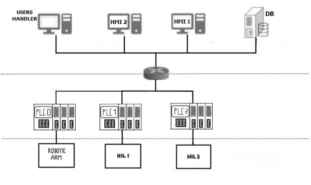

# PRECISAZIONI
Le operazioni di autenticazione e registrazione in un contesto reale non sarebbero possibili dallo stesso nodo per questioni di sicurezza ed inoltre si dovrebbe tenere traccia dell'utente durante ogni operazione per verficare se possiede le autorizzazioni necessarie per effettuare determinate azioni. E' da considerare il fatto che registrazione e login sono stati implementati con la libreria webauthn.io inoltre, la libreria è stata implementata in modo da funzionare solo con il protocollo https, quindi è necessario creare un certificato per il server. Per fare ciò, seguire le istruzioni riportate di seguito.

## CREAZIONE CERTIFICATO

## REQUISITI
E' obbligato rio aggiungere la CA al trust store del sistema operativo altrimenti il certificato non verrà riconosciuto come attendibile e non sarà possibile utilizzare il protocollo https (obbligatorio per la libreria webauth).
Su Windows, si apre mmc e si aggiunge il certificato alla sezione "Autorità di certificazione radice attendibile"

L'unico modo per poter eseguire il progetto in modo corretto è farlo attraverso la pagina web con dominio localhost, altrimenti il certificato non verrà riconosciuto come attendibile.
## PROCEDURA
https://deliciousbrains.com/ssl-certificate-authority-for-local-https-development/
```bash
openssl req -x509 -new -nodes -sha256 -days 1825 -out myCA.pem # Questo ci crea:
# La chiave privata della CA: privkey.pem
# Il certificato della CA: myCA.pem
```
```bash
# Si genera la chiave privata del server
openssl genrsa -out server.key 2048
```
```bash
# Poi creiamo la Certificate Signing Request (CSR), ovvero la richiesta di firma del certificato del server alla CA
openssl req -new -key server.key -out server.csr
```
```bash
# In server.ext modificare alt_names.DNS.1 col FQDN (Fully Qualified Domain Name)
# Poi firmiamo il certificato del server con la CA
openssl x509 -req -in server.csr -CA myCA.pem -CAkey privkey.pem -CAcreateserial -out server.crt -days 1825 -sha256 -extfile server.ext
```

# DESCRIZIONE ARCHITETTURA
Il progetto è stato realizzato con l'obiettivo di simulare un sistema di controllo di una fabbrica in cui è possibile monitorare e controllare il livello dell'acqua in due tank. Il sistema simulata la rete come in figura:


## ESECUZIONE
Aprire il terminale nella cartella del progetto e digitare:
```bash
cd deployments/
```
Nel caso in cui si voglia eseguire il progetto ed è la prima volta:
```bash
./init.sh
```
altrimenti:
```bash
./start.sh
```
